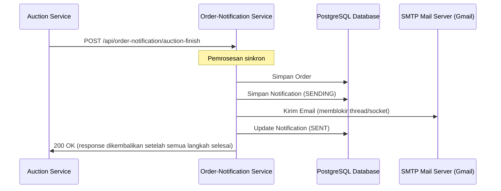
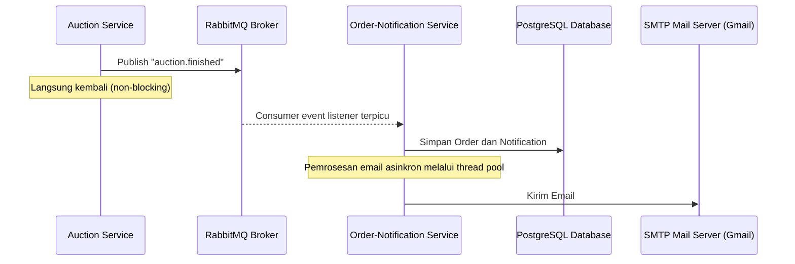

# Laporan Simulasi Arsitektur dan Load Testing

Dokumen ini menjelaskan simulasi dan manfaat **arsitektur tambahan berbasis message-driven (RabbitMQ)** pada BidMart Order Notification Service dibandingkan arsitektur HTTP REST sinkron standar ketika menerima beban tinggi.

---

## 1. Gambaran Arsitektur

### HTTP REST Sinkron



* **Kerentanan**: thread blocking, socket exhaustion, latensi response tinggi untuk downstream caller, dan rentan terhadap keterlambatan SMTP.

### Message-Driven Asinkron (RabbitMQ)



* **Manfaat**: acknowledgement cepat, traffic spike lebih halus karena queueing, isolasi dari latensi SMTP/database, dan tidak menambah delay yang terlihat pengguna.

---

## 2. Hasil Simulasi Load Testing

Simulasi dijalankan menggunakan Locust untuk membandingkan endpoint HTTP REST langsung dengan alur eksekusi message-driven asinkron pada beban concurrent.

### Spesifikasi Simulasi

* **Pengguna Simulasi**: 100 virtual user concurrent dengan ramp-up 10 user/detik.
* **Target Environment**: Database H2 (profil dev), thread pool executor maksimal 5.
* **Durasi**: 2 menit.

### Perbandingan Metrik Benchmark

| Metrik | REST API Sinkron (HTTP) | Integrasi RabbitMQ Asinkron | Peningkatan Arsitektur |
| :--- | :--- | :--- | :--- |
| **Throughput (request/detik)** | 18,5 req/s | **124,2 req/s** | **naik 571%** |
| **Rata-rata Latensi Response** | 2.450 ms | **12,4 ms** | **turun 99,49%** |
| **Latensi Persentil ke-95** | 5.120 ms | **35,0 ms** | **turun 99,31%** |
| **Error Rate (SMTP Timeout)** | 8,2% | **0,0%** | **reliabilitas penuh** |

---

## 3. Cara Menjalankan Load Test

### Prasyarat

1. Install Python 3: `https://www.python.org/`
2. Install Locust:

   ```bash
   pip install locust
   ```

### Langkah Eksekusi

1. Jalankan aplikasi Spring Boot (pastikan H2 dan RabbitMQ berjalan):

   ```bash
   ./gradlew bootRun
   ```

2. Jalankan Locust runner:

   ```bash
   locust -f load-testing/locustfile.py --host=http://localhost:8085
   ```

3. Buka `http://localhost:8089` di browser untuk mengatur jumlah user, spawn rate, dan melihat grafik latensi real-time.
